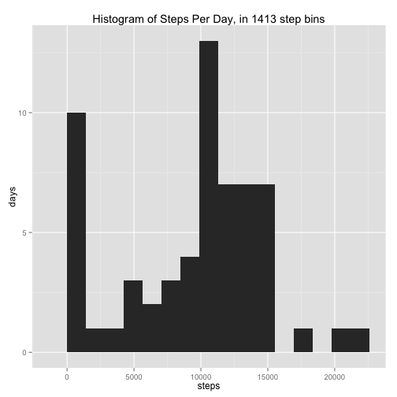
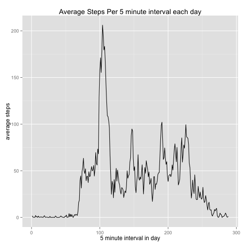
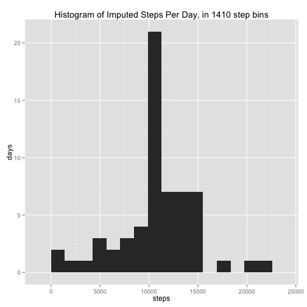
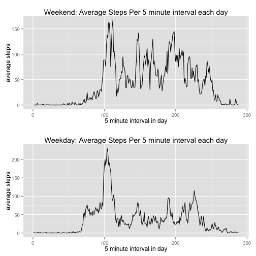

## Loading and preprocessing the data

The data being analyzed  consists of two months of activity data of an anonymous individual. It tracks the number of steps taken throughout the day, captured in 5-minute intervals. The [raw data](https://d396qusza40orc.cloudfront.net/repdata%2Fdata%2Factivity.zip) was provided as part of the Reproducible Research course on Coursera.


```r
suppressMessages( library(dplyr) )
suppressMessages( library(ggplot2) )
options(scipen=5, digits=6)
```


```r
activity <- read.csv("activity.csv", quote="\"", comment.char="",
                     colClasses=c("numeric","Date","numeric"))
activity <- mutate(activity, hour = floor(interval / 100), minute = interval %% 100 ) %>%
            mutate(time = paste0(hour,":",formatC(minute, width=2, flag=0))) %>%
            mutate(interval_seq = hour*12 + minute/5 + 1) %>%
            mutate(daytype = factor( ifelse(weekdays(activity$date) %in%
                        c("Saturday","Sunday"),"weekend","weekday")))
```

## What is mean total number of steps taken per day?

First we explore the data, using a histogram showing the distribution of total steps per day, and calculating the mean and median steps per day.


```r
by_day <- group_by(activity, date) %>%
    summarize(steps = sum(steps, na.rm=T))

binsize = (max(by_day$steps) - min(by_day$steps)) / 15
ggplot(by_day, aes(steps)) +
    geom_histogram( binwidth = binsize ) +
    labs(title = paste("Histogram of Steps Per Day, in",
                       round(binsize, digits=0), "step bins")) + 
    labs(x = "steps", y = "days")
```

 


```r
by_day_aggs <- summarize(by_day, mean = mean(by_day$steps),
                               median = median(by_day$steps) )
```

The mean steps per day is **9354.23**, and the median is **10395**.


## What is the average daily activity pattern?
The average number of steps taken in each of the 288 5-minute intervals every day shows the daily trend in step activity. 


```r
by_interval <- group_by(activity, interval_seq) %>%
    summarize(steps = mean(steps, na.rm=T))

ggplot(by_interval, aes(interval_seq, steps)) +
    geom_line() +
    labs(title = "Average Steps Per 5 minute interval each day") + 
    labs(x = "5 minute interval in day", y = "average steps")
```

 


```r
max_interval <- filter(by_interval, steps == max(steps))
max_steps <- max_interval$steps
interval_min = max_interval$interval_seq * 5
max_time <- paste0(floor(interval_min / 60), ":", interval_min %% 60)
```

The maximum average steps in any 5 minute interval is **206.17**, at **8:40** each day.

## Imputing missing values

```r
missing_rows <- is.na(activity$steps)
missing_count <- sum(missing_rows)
```

There are **2304** missing observations in the data set. In order to have a more realistic view of total steps taken by the individual during the observation period, we can impute the missing data. To do so, each missing observation is assigned the average steps taken during that same 5-minute interval on all other days for which we have values.


```r
activity_imputed <- activity
missing_intervals <- activity_imputed[missing_rows,"interval_seq"]
activity_imputed[missing_rows,"steps"] <- round(
    by_interval[missing_intervals,"steps"], digits=0)
```

We can use the data set with imputed missing values to get a more realistic view of the actual distribution of total steps per day.


```r
by_day_imputed <- group_by(activity_imputed, date) %>%
    summarize(steps = sum(steps, na.rm=T))

binsize = (max(by_day_imputed$steps) - min(by_day_imputed$steps)) / 15
ggplot(by_day_imputed, aes(steps)) +
    geom_histogram( binwidth = binsize ) +
    labs(title = paste("Histogram of Imputed Steps Per Day, in",
                       round(binsize, digits=0), "step bins")) + 
    labs(x = "steps", y = "days")
```

 


```r
by_day_imputed_aggs <- summarize(by_day_imputed, mean = mean(steps),
                                 median = median(steps) )
```

The mean imputed steps per day is **10765.6**, and the median is **10762**. By imputing missing values, we project that the average number of steps per day is actually higher than what is shown by treating missing data as if it represents 0 steps. This is demonstrated both by the increase mean and median, and also the distribution on the histogram with a pronounced reduction in the number of days in the first bin with the lowest step count.

## Are there differences in activity patterns between weekdays and weekends?
We now use this more realistic version of the data to see how the individual's step activity varies between the weekend and weekdays.


```r
activity_weekend <- filter(activity_imputed, daytype=='weekend')
activity_weekday <- filter(activity_imputed, daytype=='weekday')

weekend_by_interval <- group_by(activity_weekend, interval_seq) %>%
    summarize(steps = mean(steps, na.rm=T))

we_plot <- ggplot(weekend_by_interval, aes(interval_seq, steps)) +
    geom_line() +
    labs(title = "Weekend: Average Steps Per 5 minute interval each day") + 
    labs(x = "5 minute interval in day", y = "average steps")

weekday_by_interval <- group_by(activity_weekday, interval_seq) %>%
    summarize(steps = mean(steps, na.rm=T))

wd_plot <- ggplot(weekday_by_interval, aes(interval_seq, steps)) +
    geom_line() +
    labs(title = "Weekday: Average Steps Per 5 minute interval each day") + 
    labs(x = "5 minute interval in day", y = "average steps")

require(gridExtra)
grid.arrange(we_plot, wd_plot)
```

 


